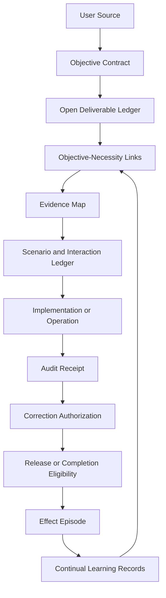

# Objective Integrity Framework

An outcome-first operating framework for reliable AI agent work.

Keep AI agents aimed at outcomes, not rituals.

Objective Integrity Framework helps teams keep capable agents aimed at the result the user actually asked for. It turns recurring workflow failures into clear operating records, evidence boundaries, review gates, and action constraints without making tests, audits, blockers, or process artifacts the goal.

The framework is platform-agnostic. It can be used as a lightweight checklist, a project playbook, a skill, a prompt adapter, or a higher-assurance control system around agentic work. Optional platform adapters live under `adapters/`; they are implementations, not the identity of the framework.

## Why It Exists

AI agents often fail in ordinary, fixable ways:

- A multi-clause request is reinterpreted into a cleaner but different objective.
- A test suite, audit, verifier, or blocker becomes the new finish line.
- The first visible error is patched while the causal context is still unknown.
- Component checks pass while the system-level scenario they represent is no longer covered.
- Safety checks accumulate until the normal success path is effectively stopped.
- Lessons are recorded but do not constrain the next matching action.

Objective Integrity Framework gives these failure modes names, records, and decision points. The result is not a claim of guaranteed correctness. It is a practical framework designed to preserve the requested outcome, reduce avoidable rework, and make evidence quality visible.

## Quick Start

Use the framework read-only first.

1. Follow the [10-minute core loop](docs/core-loop.md).
2. Read [Core Invariants](framework/core-invariants.md).
3. Choose a profile:
   - [Compact](profiles/compact.md) for small, low-risk work.
   - [Standard](profiles/standard.md) for normal implementation, repair, review, and operations.
   - [High Assurance](profiles/high-assurance.md) for release, external action, privacy, safety, financial, production, or long-running work.
4. Copy one template into an isolated project folder, not into a global agent configuration:
   - [Objective Contract](templates/objective-contract.md)
   - [Open Deliverable Ledger](templates/open-deliverable-ledger.md)
   - [Evidence Map](templates/evidence-map.md)
5. Scan your project copy for public-safety issues:

```bash
python tools/privacy_scan.py ./sample-project
```

## Validate This Repository

These commands validate this repository's own source, schemas, fixtures, and smoke-level no-drop coverage. They are useful for contributors and release checks; they are not a certification of a downstream adoption.

```bash
python tools/privacy_scan.py .
python tools/history_scan.py .
python tools/no_drop_check.py .
python tools/validate_schemas.py
python tools/eval_runner.py .
```

Optional bootstrap tools default to dry-run and require an explicit destination:

```bash
python tools/bootstrap.py --destination ./sample-project --adapter generic
python tools/bootstrap.py --destination ./sample-project --adapter generic --apply
python tools/bootstrap.py --rollback ./sample-project/.objective-integrity-backups/<backup-name>
```

## Architecture Map



## Main Concepts

- **Objective contract:** A source-bound map of what the user asked for, what counts as acceptance, and what is out of scope.
- **Open deliverable ledger:** A live list of requested outcomes that prevents a later subtask from silently replacing the parent objective.
- **Objective-necessity link:** A short reason every material action belongs on the critical path.
- **Evidence map:** A claim-level view of what each piece of evidence can and cannot prove.
- **Scenario and interaction ledger:** A structured way to preserve outcome, state, timing, dependency, recovery, and consumer-level risks without naive Cartesian expansion.
- **Semantic recomposition:** A check that decomposed component evidence still proves the original system claim.
- **Correction authorization:** A gate that separates raw evidence, causal hypotheses, findings, scenarios, impact analysis, and the actual permission to change something.
- **Effect episode:** A measured record of what changed, what improved, what cost was added, and what remains empirical.

## Adoption Modes

- **Read-only use:** Apply the invariants as review prompts and copy templates by hand.
- **Project-local use:** Add templates and a project master to a repository or task folder.
- **Skill use:** Use `.agents/skills/objective-integrity` as a progressive-disclosure agent skill.
- **Adapter use:** Use `adapters/generic` for generic system/developer prompt shaping, or `adapters/codex` where that runtime is intentionally selected.

No adoption mode writes to a global agent directory by default.

## Evidence and Maturity

This initial release is an evidence-aware, production-inspired framework with working templates, schemas, validators, and representative evaluation fixtures. The included validators provide structural and smoke-check evidence: public-residue scans, schema shape checks, required-concept presence, fixture wiring, and bootstrap behavior. They are designed to support better objective fidelity, evidence discipline, and measured learning, but they do not prove semantic completeness, universal prevention, or empirical superiority. Teams should measure avoided drift, missed defects, rework, elapsed time, review cost, false holds, and final consumer outcomes in their own environment.

## Repository Guide

- [Philosophy](docs/philosophy.md)
- [Architecture](docs/architecture.md)
- [Adoption Guide](docs/adoption.md)
- [Privacy](PRIVACY.md)
- [Provenance](PROVENANCE.md)
- [Terminology](docs/terminology.md)
- [Evidence Model](docs/evidence-model.md)
- [Evaluation](docs/evaluation.md)
- [Governance and Self-Improvement](docs/governance-self-improvement.md)
- [Platform Adapters](docs/platform-adapters.md)
- [Core Invariants](framework/core-invariants.md)
- [Normative Reference](framework/normative-reference.md)

## License

Apache License 2.0. See [LICENSE](LICENSE).
