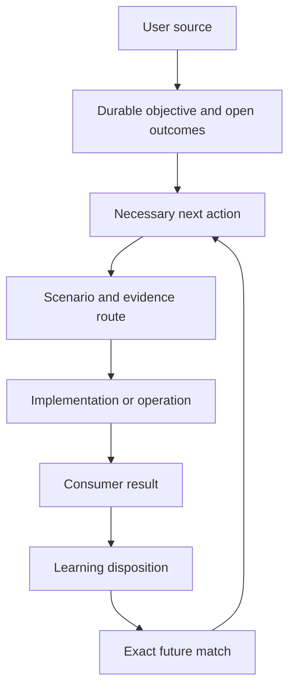

# Objective Integrity Framework

Keep the objective intact. Turn experience into better next actions.

Version **0.2.0** · [Download](https://github.com/Chisiki1/objective-integrity-framework/releases/latest) · [Changelog](CHANGELOG.md) · [Japanese guide](docs/ja/README.md).

[](https://github.com/Chisiki1/objective-integrity-framework/actions/workflows/ci.yml)
[](LICENSE)

Objective Integrity Framework is an open operating framework for agentic work that must stay faithful to the requested outcome across long tasks, corrections, handoffs, reviews, and external actions. It gives an agent a durable objective, a proportionate evidence model, and a practical learning loop without turning process artifacts into the goal.

> **Quality compounds with every pass.** A fast model that follows the framework keeps improving — out-iterating heavier, costlier models. That is the goal the framework is built around — *iterate, don't escalate*.

Use it as a five-minute review discipline, project-local guidance, a reusable agent skill, a skills-only plugin package, or a higher-assurance runtime. The core is platform-neutral. Product-specific integrations live in `adapters/` and remain optional.

## What's New

**0.2.0 update (2026-09-11):** the human objective card is now a bounded, reconciliation-led view with a
machine-readable `EVIDENCE-INDEX.json` beside it; host wiring is explicit configuration;
and the shipped skills carry the latest same-chat workflows.

- **Quality compounds with every pass:** each pass through the objective, action, observation, evidence and correction loop catches and fixes more than the last — the framework's goal is that a fast model which follows it can out-iterate heavier, costlier models.
- **A bounded card, a complete index:** the card keeps counts, pointers and continuity frontiers; full authority, source bindings, outcomes and action history stay in `EVIDENCE-INDEX.json`.
- **Explicit host bindings:** `host_binding` and `projection_filename` configuration make host-specific wiring a documented interface instead of a fork. See `adapters/hermes/` for one optional binding.
- **Late records, no rewritten history:** `action-method-supplement` aligns a late method record without hiding the original omission.

## Why It Exists

Capable agents can still lose the thread in ordinary, fixable ways:

- A multi-clause request is reinterpreted into a cleaner but different objective.
- A test suite, audit, verifier, or blocker becomes the new finish line.
- The first visible error is patched while the causal context is still unknown.
- Component checks pass while the system-level scenario they represent is no longer covered.
- Safety checks accumulate until the normal success path is effectively stopped.
- A useful lesson is recorded but never reaches the next matching action.
- A reusable skill is selected by name, order, or memory instead of current source and action facts.

Objective Integrity Framework connects each of those failure modes to an explicit decision, owner, evidence route, and recovery path. The result is a workflow that stays outcome-led while becoming easier to inspect, correct, and improve.

## What You Get

| Capability | Public path |
|---|---|
| One command directory for the complete package | `tools/oif.py`, `docs/runtime-reference.md` |
| Source-bound objective and open-outcome continuity | `runtime/objective_ledger.py`, `docs/objective-continuity.md` |
| Whole-scope build, findings collection, grouped repair, and acceptance | `docs/whole-scope-work.md`, `runtime/skills/master-guided-skill-lifecycle/` |
| Compact, standard, and high-assurance operating profiles | `profiles/`, `framework/core-invariants.md` |
| Mid-work objective control and material-transition admission | `runtime/skills/objective-supervisor-control/`, `runtime/skills/workflow-transition-admission/` |
| Blind scenario, interaction, and semantic-recomposition records | `runtime/skills/scenario-interaction-closure/`, `framework/normative-reference.md` |
| Provenance-bound skill selection and exact application chain | `runtime/skills/master-guided-skill-resolver/`, `docs/skill-book.md` |
| Action-linked learning queue, source index, and lifecycle decisions | `runtime/skills/master-guided-skill-lifecycle/`, `docs/governance-self-improvement.md` |
| Compact current knowledge with complete retrievable history | `docs/knowledge-stewardship.md`, `runtime/skills/master-guided-skill-lifecycle/` |
| Exact, bounded access to versioned artifacts | `runtime/skills/artifact-access/`, `tools/oif.py artifact` |
| Self-contained skills-only plugin packaging | `tools/plugin.py`, `docs/plugin.md` |
| Project-local preview, installation, settings-preserving update, and rollback | `tools/bootstrap.py`, `docs/adoption.md` |
| Optional runtime integrations | `adapters/` |

## Quick Start

New here? [Download a release](docs/releases.md#choose-one-download), verify its
checksum and extract it. No package manager or global installation is required.

Try the complete workflow in a new or empty sandbox, then install only into a separate destination you choose.

1. Run the synthetic demonstration outside this checkout:

```bash
python tools/demo.py --directory ../oif-demo
```

2. Follow the [10-minute core loop](docs/core-loop.md), then choose [Compact](profiles/compact.md), [Standard](profiles/standard.md), or [High Assurance](profiles/high-assurance.md).
3. Preview a complete project-local installation into another separate directory:

```bash
python tools/bootstrap.py --destination ../sample-project --adapter generic --mode complete
```

4. Review the printed members and copy its `plan-sha256`. Apply only while that exact preview still matches:

```bash
python tools/bootstrap.py --destination ../sample-project --adapter generic --mode complete --expect-plan <plan-sha256> --apply
```

The demo and adoption destinations must remain separate from this distribution tree. The preview does not write to the destination. `--expect-plan` binds source bytes, destination pre-state, adapter, mode, and installer identity to the reviewed preview; a mismatch asks for a fresh preview without changing destination files. Apply is destination-bounded, records replaced and created files, and creates rollback material before replacement. No mode writes to a global agent directory by default. See the [Adoption Guide](docs/adoption.md) for the exact write set, the explicit current-state apply route, recovery behavior, and manual/read-only options.

## The Core Loop

```text
source -> objective and open outcomes -> next necessary action
       -> evidence and actual effect -> reusable learning
       -> exact later match -> better next action
```

The same conversation normally owns the objective and the work. An independent reviewer remains read-only toward the candidate it reviews. Separate legacy coordinator/executor recovery is available only when an existing split-task lease requires it.

For substantial implementation, keep one complete scope while splitting useful construction work. Build all requested parts and their required connections, collect findings across the frozen candidate, repair shared causes together, and accept against the original outcome. Small build checks stay available when they are needed to choose the next implementation; they do not become repeated mini-release cycles. See [Whole-Scope Work](docs/whole-scope-work.md).

Learning happens in retained knowledge, reusable skills, and changed next actions. When an eligible improvement preserves the user's conditions and has the needed evidence and recovery path, the owner carries it into use without waiting for another prompt. Useful improvements can also simplify or remove process. The measure is a better consumer result and total delivery cost, not a longer instruction file.

## Repository Checks

Contributors can run the complete static check entrypoint:

```bash
python -B tools/check.py
```

For runtime tests and isolated consumers, use `python -B tools/check.py --runtime
--temp-root <existing-separate-temp-directory>`. See [Contributing](CONTRIBUTING.md)
for prerequisites, platform coverage and focused-development guidance.

These checks report the bounded claims they inspect. Runtime and external outcomes use their own evidence routes; see [Evidence Model](docs/evidence-model.md).

For the complete command directory, run:

```bash
python tools/oif.py --help
python tools/oif.py objective --help
```

The directory is a thin dispatcher to the public implementations. It does not add implicit roots, permissions, or background services.

## Architecture Map



## Main Concepts

- **Durable objective state:** Immutable source events, explicit source classification, open outcomes, pending effects, append-only history, and a concise human projection.
- **Whole-scope execution:** One owner-controlled completion scope connects bounded jobs to the complete result; phase checks prevent premature formal verification from replacing unfinished implementation.
- **Current knowledge and history:** Replace superseded current guidance while preserving exact, searchable backing. Repeated source references are factored rather than repeatedly pasted into the objective view.
- **Objective contract:** A source-bound map of what the user asked for, what counts as acceptance, and what is out of scope.
- **Open deliverable ledger:** A live list of requested outcomes that prevents a later subtask from silently replacing the parent objective.
- **Objective-necessity link:** A short reason every material action belongs on the critical path.
- **Evidence map:** A claim-level view of what each piece of evidence can and cannot prove.
- **Scenario and interaction ledger:** A structured way to preserve outcome, state, timing, dependency, recovery, and consumer-level risks without naive Cartesian expansion.
- **Semantic recomposition:** A check that decomposed component evidence still proves the original system claim.
- **Correction authorization:** A gate that separates raw evidence, causal hypotheses, findings, scenarios, impact analysis, and the actual permission to change something.
- **Effect episode:** A measured record of what changed, what improved, what cost was added, and what should be revised, narrowed, merged, or retired.
- **Skill Book plane:** A focused-instruction layer that compiles source and action facts, resolves exact reusable guidance, binds selected bytes to execution, and keeps selection, action result, observed effect, and lifecycle status distinct.

## Adoption Modes

- **Read-only:** Apply the core loop without changing configuration.
- **Project-local:** Install the complete generic package into an explicit project destination.
- **Skill:** Use `.agents/skills/objective-integrity` for progressive agent guidance.
- **Plugin:** Build the self-contained skills-only package for a compatible host; see [Plugin Packaging and Use](docs/plugin.md). Installation remains an explicit host action.
- **Adapter:** Add only the integration for the runtime you intentionally use.
- **Advanced:** Adopt the Skill Book, learning queue, native preflight, or legacy recovery adapter when the work needs them.

No adoption mode writes to a global agent directory by default.

## Evidence and Maturity

The repository distinguishes evidence that a record is well formed from evidence that a real consumer outcome occurred. Templates, schemas, and validators support structural confidence. Behavioral, runtime, and external claims are tied to the route that can observe them. Teams can measure objective completion, avoided rework, missed defects, false holds, rollback success, elapsed cost, and final consumer outcomes without turning those metrics into substitute objectives.

## Repository Guide

- [Releases, Downloads and Verification](docs/releases.md)
- [Measured Query-Response Size](docs/measurements.md)
- [Help and Feedback](docs/support.md)
- [Philosophy](docs/philosophy.md)
- [Architecture](docs/architecture.md)
- [Adoption Guide](docs/adoption.md)
- [Objective Continuity](docs/objective-continuity.md)
- [Runtime Reference](docs/runtime-reference.md)
- [Plugin Packaging and Use](docs/plugin.md)
- [Troubleshooting](docs/troubleshooting.md)
- [Privacy](PRIVACY.md)
- [Provenance](PROVENANCE.md)
- [Terminology](docs/terminology.md)
- [Evidence Model](docs/evidence-model.md)
- [Evaluation](docs/evaluation.md)
- [Governance and Self-Improvement](docs/governance-self-improvement.md)
- [Whole-Scope Work](docs/whole-scope-work.md)
- [Knowledge Stewardship](docs/knowledge-stewardship.md)
- [Japanese Guide](docs/ja/README.md)
- [Skill Book Plane](docs/skill-book.md)
- [Skill Book Fallback Example](examples/skill-book-fallback.md)
- [Minimal Skill Book Example](examples/skill-book-minimal/README.md)
- [Platform Adapters](docs/platform-adapters.md)
- [Core Invariants](framework/core-invariants.md)
- [Normative Reference](framework/normative-reference.md)

## License

Apache License 2.0. See [LICENSE](LICENSE).

## Sponsors

Thanks to [@BlueSnyaiper](https://x.com/BlueSnyaiper) and [@kekkon_soon](https://x.com/kekkon_soon) for providing computing resources.
