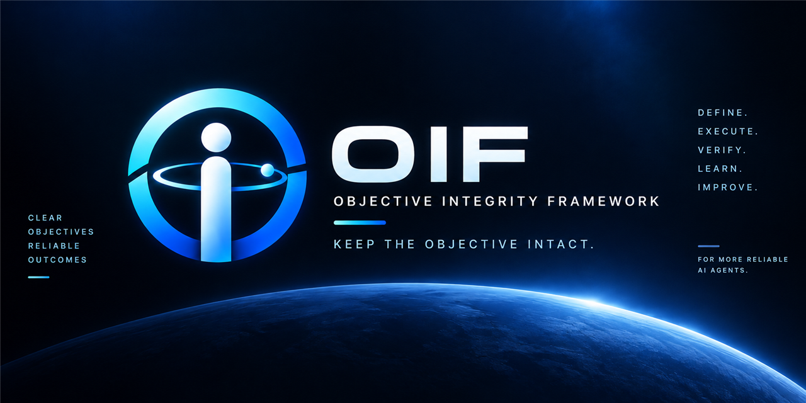

# Objective Integrity Framework — 日本語ガイド

主目的を保ち、経験を次の行動の改善につなげる。

対応ドキュメント版: 2026-09-08。[English](../../README.md)

Objective Integrity Framework は、AIエージェントが長い作業や修正を進める際に、依頼された成果を見失わず、得られた知見を実際の次の行動へ反映するためのオープンな運用フレームワークです。主目的の記録、必要な証拠、改善の採用と効果確認を結び付けます。記録や監査を増やすこと自体は目的にしません。

このページは任意で読める日本語の導入・機能ガイドです。英語のREADMEと同じ版の主要機能・導入手順を説明し、詳細な仕様は各リンク先の英語リファレンスへ案内します。中核は特定の製品やモデルに依存せず、Codexなどの連携はオプションです。

## できること

| 機能 | 作業へのつながり |
|---|---|
| 主目的と未完了成果の保持 | 追加指示、再開、コンテキスト圧縮を経ても、元の依頼と残作業を保持します。 |
| 要求全体を単位にした進行 | 必要な実装と接続を揃え、全体を確認し、見つかった問題をまとめて修正します。 |
| 根拠と効果の区別 | ファイルの整合性、テスト結果、実際の利用結果を別々に扱います。 |
| Skillの選択と実使用 | 現在の依頼と確定した操作に合う手順を選び、実行結果と後の効果まで追います。 |
| 自律的な改善 | 既存の権限と条件を守れる改善は、必要な確認と復旧経路が揃えば次の指示を待たずに適用します。 |
| 現行情報と履歴の整理 | 現在使う情報を更新しつつ、過去の原文・失敗・判断を検索可能な形で残します。 |
| 分離した導入と更新 | 指定したプロジェクト内に導入し、既存設定を残す更新とロールバックを提供します。 |

## 最初に試す

実行機能にはPython 3.10以降と標準ライブラリの`sqlite3`が必要です。追加のPythonパッケージは不要です。読み物や手動運用だけであればPythonは必要ありません。

以下は、このリポジトリのルートで実行する例です。配布元とは別の、新規または空のディレクトリを指定してください。

```bash
python tools/demo.py --directory ../oif-demo
```

デモは合成データを使い、主目的の作成、進捗入力、操作結果、学習候補と再検索をつなげます。`current_workflow`には、全範囲の実装から問題の洗出し、一括修正、再確認、受入れまでの例が含まれます。最初の問題は`current-workflow/first-sweep-observations.json`に残り、修正後の観測と比較できます。割当の型付き入力や現行情報・履歴の検索も確認できます。

デモはエージェントの起動やグローバル設定の変更を行いません。デモ内のレビュー参照は構造を説明する合成例であり、人や別エージェントによる独立レビューの実績ではありません。

## プロジェクトへ導入する

まず書込みを行わないプレビューを確認します。

```bash
python tools/bootstrap.py --destination ../sample-project --adapter generic --mode complete
```

出力の対象ディレクトリ、追加・置換ファイル、バックアップ先、`plan-sha256`を確認し、そのハッシュを次のコマンドへ入れます。

```bash
python tools/bootstrap.py --destination ../sample-project --adapter generic --mode complete --expect-plan <plan-sha256> --apply
```

配布元・導入先・デモの保存先は分離します。完全版は導入先の`.oif/`に入り、選択したアダプターの案内ファイルがプロジェクト側に置かれます。プレビュー後に元のファイルや導入先が変われば、そのプランでは書き込まず、再確認を求めます。グローバルなエージェント設定へ標準で書き込むモードはありません。

`--expect-plan`なしの明示的な`--apply`も利用できますが、これは実行時の状態に対する操作で、以前のプレビューに結び付いた操作ではありません。通常は上記のプレビューとハッシュを使う経路が分かりやすい方法です。

導入先に入ったファイルだけでデモを実行できます。

```bash
python ../sample-project/.oif/tools/demo.py --directory ../oif-demo-installed
```

必要な機能だけを選ぶこともできます。

- 読取りのみ: [基本のループ](../core-loop.md)を作業の確認に使います。
- 手動: 必要な[テンプレート](../../templates/objective-contract.md)をプロジェクト内で使います。
- Skill: 対応するホストで[プロジェクトSkill](../../.agents/skills/objective-integrity/SKILL.md)を読み込みます。最小構成には実行用ランタイムは含まれません。
- 完全版: 永続台帳、Skill選択、学習キュー、進行確認などのコマンドを利用します。
- アダプター: `generic`、`codex`、`skill-book`から必要な連携を明示的に選択します。

## 既存の導入を更新する

新しい配布元のディレクトリから実行します。導入先の`.objective-integrity-backups`は削除せずに保持してください。そこにある有効な完全導入のマニフェストが、配布パッケージの所有ファイルと元のハッシュを示します。以前の`oif-install-v2`と現在の`oif-install-v3`に対応します。

```bash
python tools/bootstrap.py --destination ../sample-project --adapter generic --mode complete --update
```

表示された更新対象・削除予定の旧パッケージファイル・プランのハッシュを確認して適用します。プランは選択された導入記録のマニフェストにも結び付いており、その内容が変われば以前のプレビューでは適用しません。

```bash
python tools/bootstrap.py --destination ../sample-project --adapter generic --mode complete --update --expect-plan <plan-sha256> --apply
```

更新範囲は`.oif/`内の配布パッケージです。プロジェクト直下の`AGENTS.md`、プロジェクトSkill、主目的記録、利用者設定は上書きしません。既存と同じアダプターを指定してください。この操作はアダプター移行ではありません。案内文の変更をプロジェクトのカスタマイズへ取り込む場合は、別途差分を確認します。

配布後に編集された所有ファイル、新しい配布先と衝突する利用者ファイル、変化したプレビュー、未解決の前回操作は検出して停止します。無関係なファイルを削除対象にしません。不要になった旧配布ファイルは、所有記録と現在のハッシュが一致する場合だけバックアップ付きで削除します。改変内容は保存してから明示的に調整してください。有効な完全導入の記録がない場合は、新しい分離先へ導入して必要な内容を移します。

## 復旧と動作確認

適用時に表示されたバックアップディレクトリを保持します。その操作を戻すには次を使います。

```bash
python tools/bootstrap.py --rollback <backup-directory>
```

置換・削除したファイルを戻し、その操作で新規作成したファイルを除きます。適用後に利用者が変更したファイルがあれば、その変更を上書きせず競合を報告します。中断した復旧も、最初の障害と復旧済み範囲を残して扱います。対応マニフェストのない手動導入は、自分でコピーした範囲だけを手動で戻します。

導入済みランタイムの検証には、配布元と導入先の外に新しい使い捨ての親ディレクトリを用意します。

```bash
mkdir ../oif-check-work
python ../sample-project/.oif/tools/check.py --installed-runtime --temp-root ../oif-check-work
```

既存の無関係な内容がある場所は使わないでください。検証側がその親の下に専用の子ディレクトリを作成します。Windowsで長いパスが利用できない場合は、短い明示的な保存先を選択します。

## 主目的を保つ仕組み

公開ランタイムは、正確な原文と追記専用の`journal.jsonl`、機械用の`current.json`、人が読む`objective.txt`を分けます。同じ論理会話では台帳を再利用し、分岐した会話は別の識別子を使います。追加・明確化・訂正・置換・撤回を区別し、影響しない未完了成果を保持します。

追加指示、重要な結果、作業項目の完了、再開・圧縮復帰、最終回答の前に現在の台帳を読みます。繰り返し現れる原文の識別情報は辞書と参照にまとめ、原文の位置や成果を削らずに表示の重複を減らします。`objective-input`は既存台帳の版と現在の状態に結び付いた入力を支援します。自動的な読み込みやフック配信にはホスト側の連携が必要で、ファイルを置くだけで有効化されたとは扱いません。

## 作業を完了へつなげる

BUILDで要求全体の実装と必要な接続を揃え、SWEEPで固定した候補を工程に応じて確認し、REPAIRで収集した問題の共通原因をまとめて修正し、ACCEPTで元の依頼に対する成果を確認します。構築中の小さな確認は、次の実装判断に必要な場合に使えますが、未完成の全体を受入れ済みにするものではありません。

独立した安全な確認は、別の確認が失敗しても続けられます。最初の障害は残し、未実施部分を成功扱いしません。必須の問題と任意の改善を区別し、求められていない条件を勝手に受入れ基準へ追加しません。分担した作業が完了しても、主担当が持つ全体の完了範囲は縮みません。詳しくは[全範囲の作業](../whole-scope-work.md)を参照してください。

## 自己改善・学習を実際の行動へ

Project Masterは具体的な事実と失敗、Global Masterは再利用できる知識を持ちます。現在使う制御情報と完全な履歴を分け、古い現行説明を更新します。履歴を消して短くするのではなく、元の証拠を残して検索できるように整理します。

学びには所有者、成果物、次に使う条件、期待効果、復旧方法を付けます。既存の権限、条件保持、通常経路の確認、独立した反証、限定適用と復旧が揃えば、追加の指示を待たず実際に使います。条件変更の承認待ちがあっても、条件を変えずにできる改善まで止めません。ユーザー条件の意味を変える場合は、その具体的な変更への承認が必要です。

停滞や再発に対しては、小さな修正だけでなく、作業単位・入口・表現・所有者の変更や、仕組みの統合・削減も比較します。新しさやSkillの数ではなく、成果、手戻り、副作用、総所要時間を見ます。判断に役立つ場合は最新の一次情報と反例を調べますが、APIの機能を現在のホストで使える機能と混同しません。記録を読んだこと、構造検証が通ったこと、実行したこと、利用者に効果が届いたことは別々に確認します。

## 詳細リファレンス

- [導入・更新・復旧](../adoption.md)
- [主目的の継続性](../objective-continuity.md)
- [ランタイムの全コマンド](../runtime-reference.md)
- [現行情報と履歴の整理](../knowledge-stewardship.md)
- [自己改善と条件管理](../governance-self-improvement.md)
- [Skill Book](../skill-book.md)
- [証拠の区分](../evidence-model.md)
- [詳細な運用仕様](../../framework/normative-reference.md)
- [プライバシー](../../PRIVACY.md)

## ライセンス

Apache License 2.0。[LICENSE](../../LICENSE)を参照してください。

## スポンサー

計算リソースをご提供いただいた [@BlueSnyaiper](https://x.com/BlueSnyaiper) さん、[@kekkon_soon](https://x.com/kekkon_soon) さんに感謝します。
