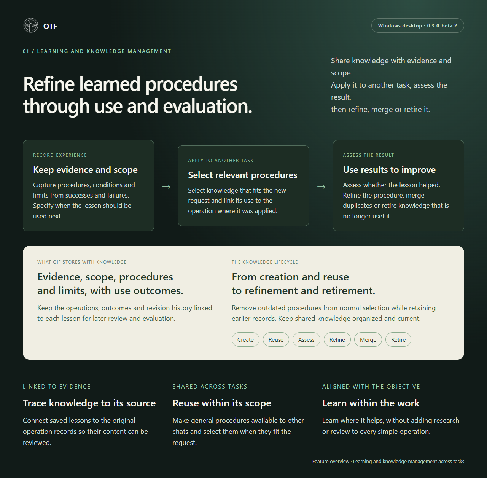
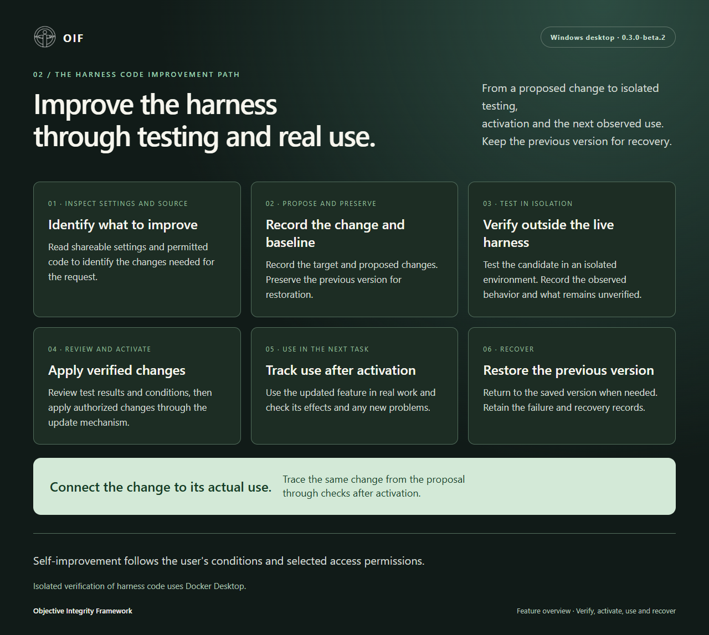
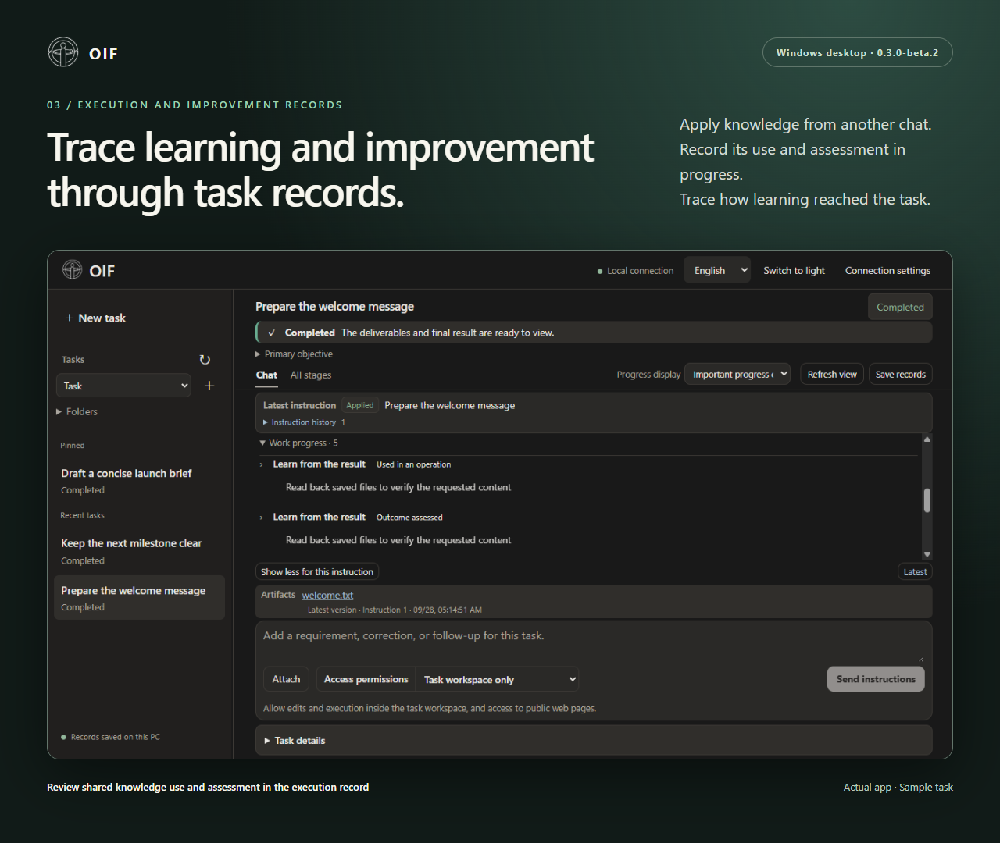

# OIF Desktop showcase · 0.3.0-beta.4

[Japanese edition](ja/README.md) · [Desktop guide](https://github.com/Chisiki1/objective-integrity-framework/blob/v0.3.0-beta.4/harness/README.md)

## 01 — Refine learned procedures through use and evaluation.

Save knowledge with evidence, conditions, procedures and limits, then reuse it in other tasks. Record the operation and outcome of each use, and use the assessment to refine, merge or retire it. Retain earlier records while keeping shared knowledge organized and current.

## 02 — Improve the harness through testing and real use.

Test proposed changes to OIF in isolation, then apply verified changes. Track subsequent use and its results, and restore the saved version when needed. The user's conditions and permissions also apply to self-improvement.

## 03 — Trace learning and improvement through task records.

The app shows knowledge from another chat used in an operation and the outcome assessed. Progress records connect the shared lesson to its actual use.

Images 1 and 2 explain OIF features. Image 3 shows a sample task in the actual app. The example uses scripted model replies; file operations and cross-chat lesson use run through the real engine. Reproduce it with `harness/examples/create_demo.py` from the source distribution.

Images and HTML are licensed under the repository's Apache-2.0 license. The full source archive includes the HTML layouts and original UI captures. The showcase ZIP contains six finished PNGs: three English and three Japanese, in the same order.
