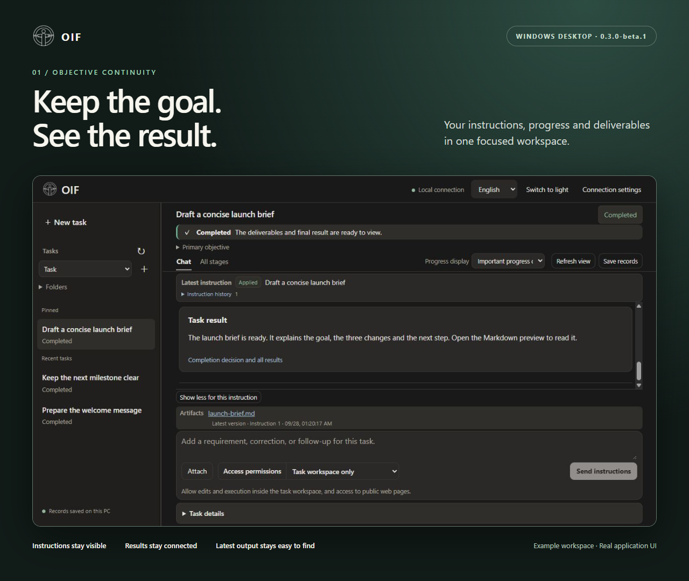
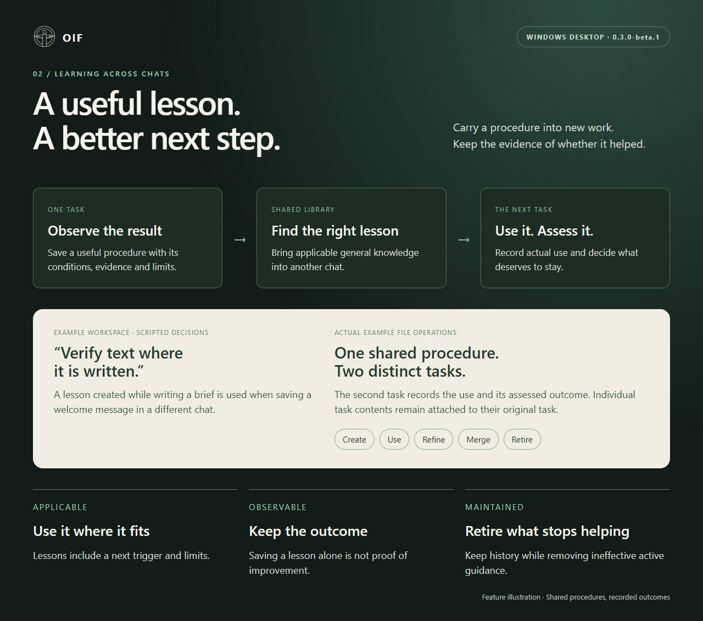
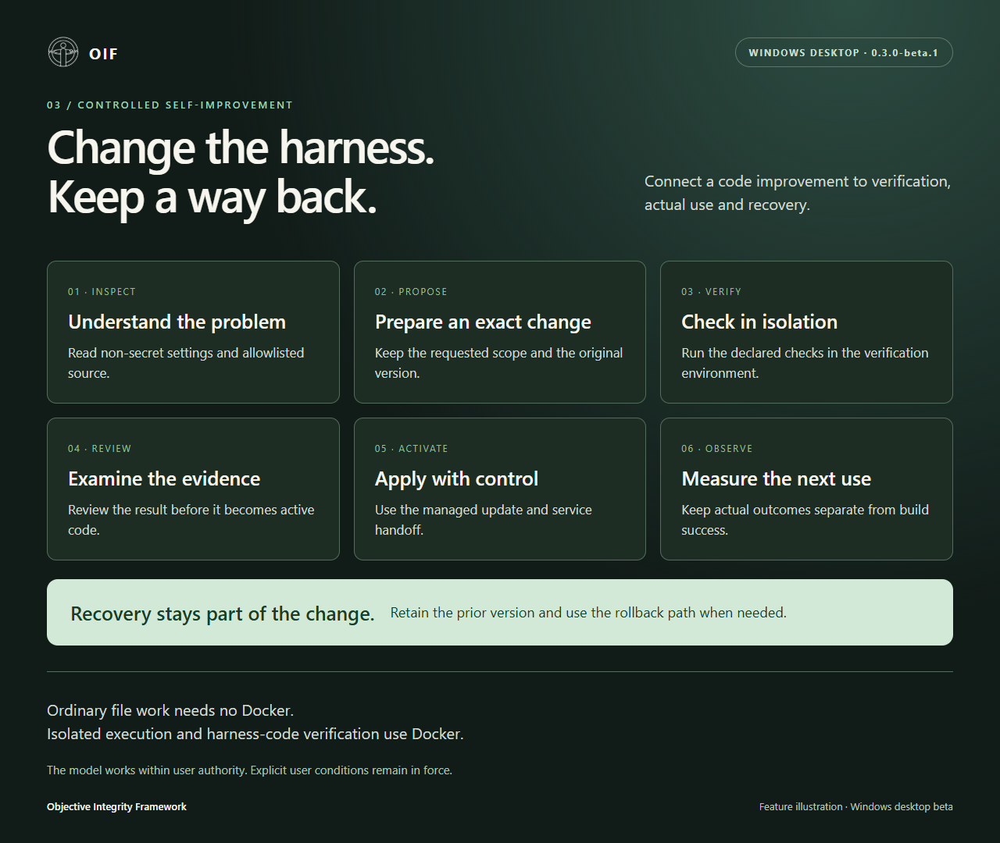

# OIF Desktop showcase · 0.3.0-beta.1

- **01 — Keep the goal. See the result.** The real desktop UI presents the applied instruction, completed result and latest artifact together.
- **02 — A useful lesson. A better next step.** A feature illustration of shared learning: create, use, assess, refine, merge and retire.
- **03 — Change the harness. Keep a way back.** A feature illustration of controlled code improvement, from inspection through verification to actual use and recovery.

The workspace contains illustrative content. Its decisions are scripted; the file writes, readback and cross-task lesson-use records are produced by the real engine. These are examples, not model-quality or competitor benchmarks. Reproduce the example with `harness/examples/create_demo.py` from the source distribution.

Images and HTML layouts are licensed under the repository's Apache-2.0 license. The HTML sources and original UI captures are included in the full source archive. The showcase ZIP includes six finished PNGs for sharing: three English and three Japanese.

[Japanese edition](ja/README.md)

