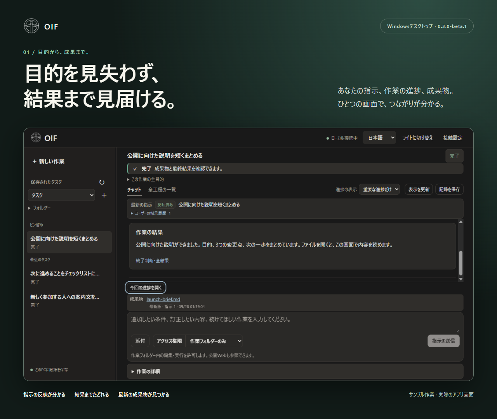
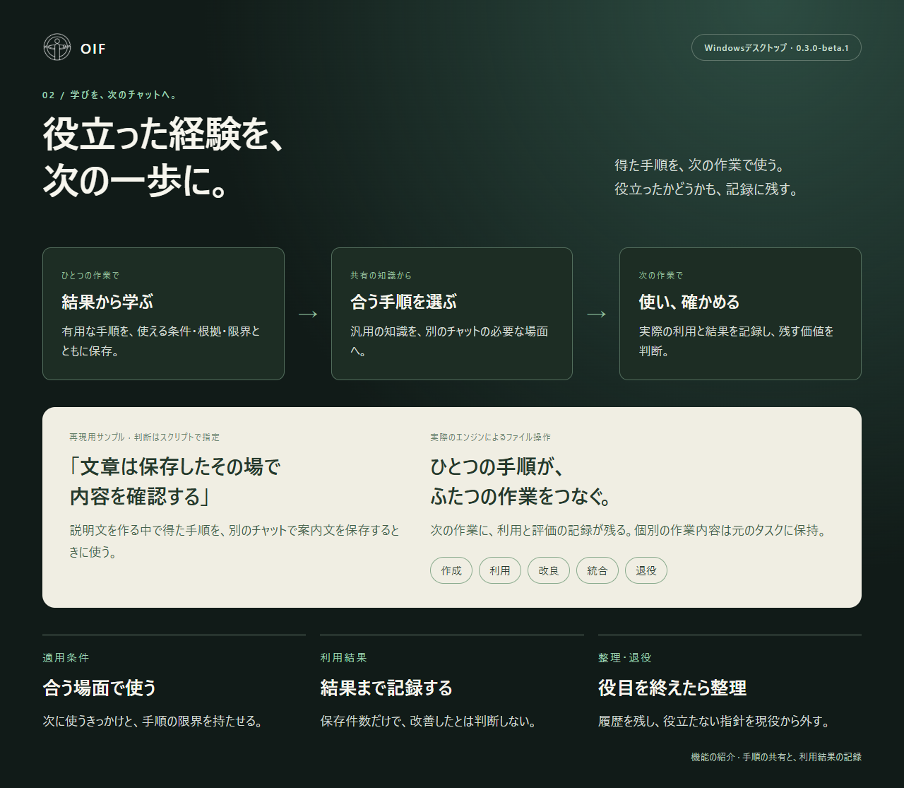
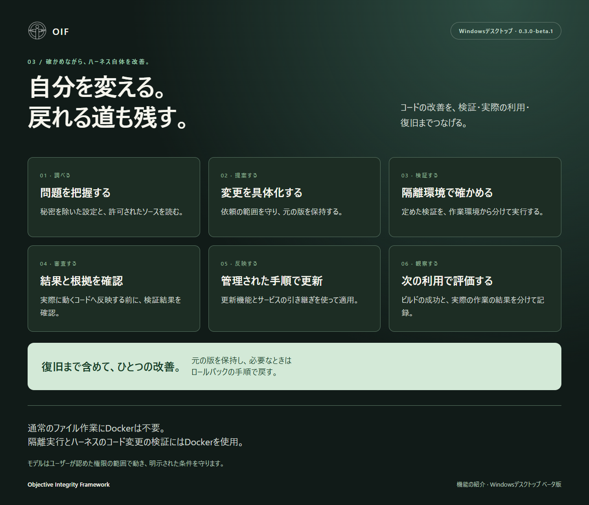

# OIF Desktop 紹介画像 · 0.3.0-beta.1

[English](../README.md) · [日本語ガイド](https://github.com/Chisiki1/objective-integrity-framework/blob/v0.3.0-beta.1/harness/docs/ja.md)

## 01 — 目的を見失わず、結果まで見届ける。

反映された指示、作業結果、最新の成果物をまとめて確認できる実際の画面です。

## 02 — 役立った経験を、次の一歩に。

手順を作成し、別のチャットで使い、結果を評価する流れを紹介します。改良・統合・退役も、履歴を保持しながら扱います。

## 03 — 自分を変える。戻れる道も残す。

ハーネスのコード改善を、検証・反映・次の利用・復旧へつなぐ機能を紹介します。

画面内の文章はサンプルです。判断は再現用スクリプトで指定し、ファイルの保存・読み戻し・別タスクでの手順利用は実際のエンジンで実行しています。モデルや他製品との性能比較を示すものではありません。ソース配布の `harness/examples/create_demo.py` に `--language ja` を指定すると再現できます。

画像とHTMLはリポジトリと同じApache-2.0ライセンスです。紹介画像ZIPには英語3枚・日本語3枚を収録しています。HTMLと元の画面キャプチャは全ソースZIPに含まれます。
