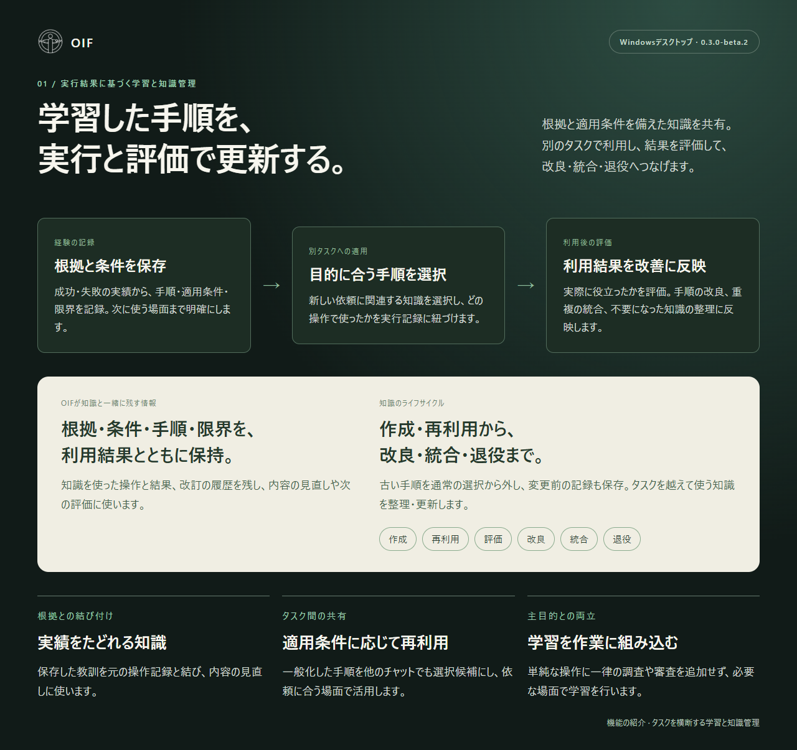
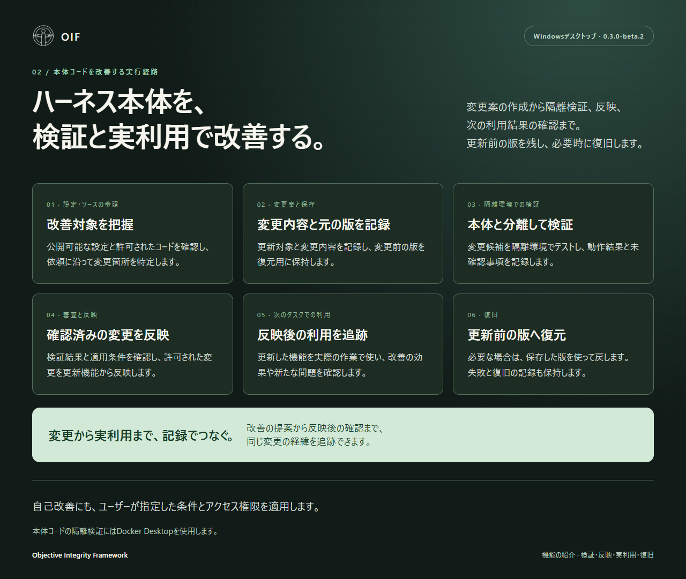
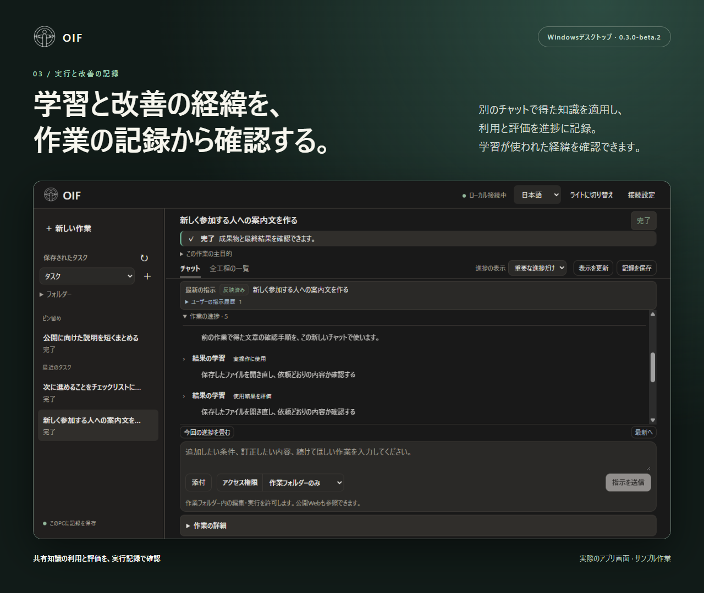

# OIF Desktop 紹介画像 · 0.3.0-beta.3

[English](../README.md) · [日本語ガイド](https://github.com/Chisiki1/objective-integrity-framework/blob/v0.3.0-beta.3/harness/docs/ja.md)

## 01 — 学習した手順を、実行と評価で更新する。

根拠・適用条件・手順・限界を備えた知識を保存し、他のタスクで再利用します。利用した操作と結果を記録し、評価に応じて改良・統合・退役へ進めます。変更前の記録も保持し、知識を継続的に整理・更新します。

## 02 — ハーネス本体を、検証と実利用で改善する。

OIF本体の変更案を隔離環境で検証し、確認した変更を反映。反映後の実利用まで結果を追い、必要なら保存した更新前の版へ復旧します。ユーザーが指定した条件と権限は自己改善にも適用します。

## 03 — 学習と改善の経緯を、作業の記録から確認する。

別のチャットで得た知識を実際の操作で使い、使用結果を評価した記録を表示しています。学習が実際の作業に適用された経緯を、進捗から確認できます。

1・2枚目はOIFの機能を説明する図です。3枚目はサンプル作業を表示した実際のアプリ画面です。画面の再現には用意したAIの返答を使い、ファイル操作と別チャットでの手順利用は実際のエンジンで実行しています。`harness/examples/create_demo.py --language ja` で再現できます。

画像とHTMLはリポジトリと同じApache-2.0ライセンスです。全ソースZIPにはHTMLと元のアプリ画面を収録しています。紹介画像ZIPには、日本語3枚と英語3枚を同じ順番で収録しています。
